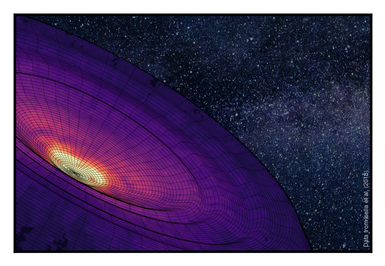

# disksurf

<p align='center'>
  
  <br>
  <a href='https://disksurf.readthedocs.io/en/latest/?badge=latest'>
    
  </a>
  <a href='https://doi.org/10.21105/joss.03827'>
    
  </a>
  <a href="https://zenodo.org/badge/latestdoi/184391824">
    
  </a>
</p>

## What is it?

`disksurf` is a package which contains the functions to measure the height of optically thick emission, or photosphere, using the method presented in [Pinte et al. (2018)](https://ui.adsabs.harvard.edu/abs/2018A%26A...609A..47P/abstract) (with associated [example script](https://github.com/cpinte/CO_layers)).

## How do I install it?

Grab the latest version from PyPI:

```
$ pip install disksurf
```

This has a couple of dependencies, namely [astropy](https://github.com/astropy/astropy) and [GoFish](https://github.com/richteague/gofish), which should be installed automatically if you don't have them. To verify that everything was installed as it should, running through the [tutorials](https://disksurf.readthedocs.io/en/latest/tutorials/tutorial_1.html) should work without issue.

## How do I use it?

At its most basic, `disksurf` is as easy as:

```python
from disksurf import observation                        # import the module
cube = observations('path/to/cube.fits')                # load up the data
surface = cube.get_emission_surface(inc=30.0, PA=45.0)  # extract the surface
surface.plot_surface()                                  # plot the surface
```

Follow our [tutorials](https://disksurf.readthedocs.io/en/latest/tutorials/tutorial_1.html) for a quick guide on how to use `disksurf` with DSHARP data and some of the additional functions that will help you extract the best surface possible.

## Citation

If you use this software, please remember to cite both [Pinte et al. (2018)](https://ui.adsabs.harvard.edu/abs/2018A%26A...609A..47P/abstract) for the method, and [Teague et al. (2021)](https://joss.theoj.org/papers/10.21105/joss.03827#) for the software.

```
@article{2018A&A...609A..47P,
  doi = {10.1051/0004-6361/201731377},
  year = {2018},
  volume = {609},
  eid = {A47},
  pages = {A47},
  author = {{Pinte}, C. and {M{\'e}nard}, F. and {Duch{\^e}ne}, G. and {Hill}, T. and {Dent}, W.~R.~F. and {Woitke}, P. and {Maret}, S. and {van der Plas}, G. and {Hales}, A. and {Kamp}, I. and {Thi}, W.~F. and {de Gregorio-Monsalvo}, I. and {Rab}, C. and {Quanz}, S.~P. and {Avenhaus}, H. and {Carmona}, A. and {Casassus}, S.},
  title = "{Direct mapping of the temperature and velocity gradients in discs. Imaging the vertical CO snow line around IM Lupi}",
  journal = {\aap}
}

@article{disksurf,
  doi = {10.21105/joss.03827},
  url = {https://doi.org/10.21105/joss.03827},
  year = {2021},
  publisher = {The Open Journal},
  volume = {6},
  number = {67},
  pages = {3827},
  author = {Richard Teague and Charles J. Law and Jane Huang and Feilong Meng},
  title = {disksurf: Extracting the 3D Structure of Protoplanetary Disks},
  journal = {Journal of Open Source Software}
}
```
